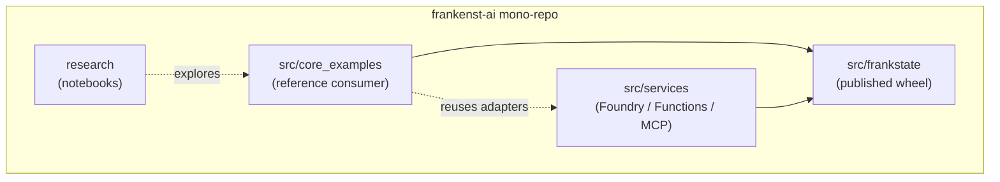
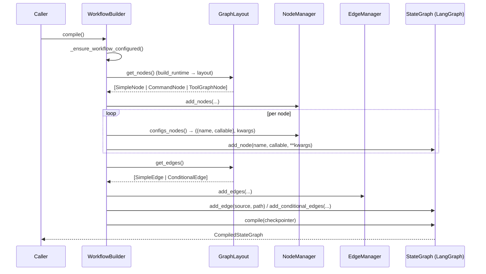
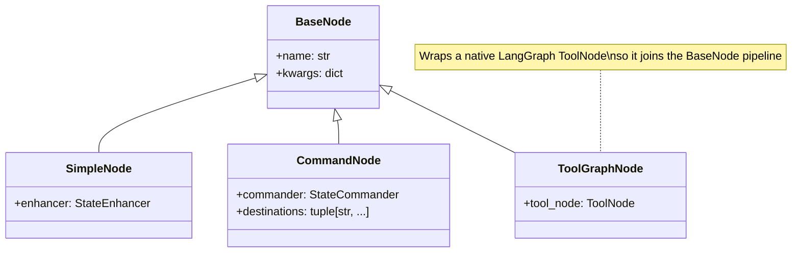
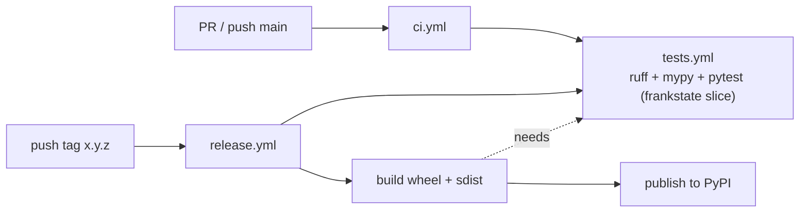

# Architecture

This document describes the technical architecture of the **Frankenst-AI** mono-repo:
its layers, the internal design of the published `frankstate` package, the assembly
lifecycle that turns declarative layouts into native LangGraph graphs, and the
boundaries that keep the reusable core decoupled from example and integration code.

It is intended for contributors and integrators who need to understand *how* the
pieces fit together, not just *how to use* them. For usage and installation, see
[`README.md`](README.md) (mono-repo) and [`README-pypi.md`](README-pypi.md) (package).

---

## 1. Design goals

`frankstate` is **not** a runtime that replaces LangGraph. It is a thin, reusable
assembly layer that returns an official LangGraph `StateGraph`/`CompiledStateGraph`
at the end of the build. The architecture optimizes for:

- **Separation of concerns** — nodes, conditional edges, command routing and runnable
  construction are encapsulated as independent, testable contracts.
- **Reusability** — `StateEnhancer`, `StateEvaluator`, `StateCommander` and
  `RunnableBuilder` are designed to be shared across multiple workflows.
- **Scalability without duplication** — graph topologies are declared in explicit
  `GraphLayout` classes (optionally fed by YAML), assembled by managers, and compiled
  by a single builder.
- **Forward compatibility with LangGraph** — native `add_node()` options flow through a
  generic passthrough seam, so new LangGraph capabilities are usable without changing
  the core.

---

## 2. Repository layers

The repository is a mono-repo with four layers and different stability expectations.

| Layer | Path | Role | Stability |
|-------|------|------|-----------|
| **Core package** | `src/frankstate` | Reusable pattern layer; the only code shipped in the published wheel | Public, stable |
| **Reference examples** | `src/core_examples` | One concrete way to consume `frankstate` (RAG, agent+tools, human-in-the-loop) | Reference, not a public contract |
| **Services / integration** | `src/services` | Repository-specific runtimes & deployment entrypoints (Azure Foundry, Functions, MCP) | Integration-specific |
| **Research** | `research` | Exploratory notebooks and experiments | Non-contractual |



**Dependency rule:** `frankstate` never imports from `core_examples` or `services`.
The arrows above only point *into* the core. This is the invariant that keeps the
published package self-contained.

---

## 3. The `frankstate` package

### 3.1 Public API surface

The package root intentionally exposes a single symbol:

```python
from frankstate import WorkflowBuilder
```

Everything else is imported from concrete submodules to prevent the root from becoming
an absolute-import bucket:

```python
from frankstate.entity.graph_layout import GraphLayout
from frankstate.entity.node import SimpleNode, CommandNode, ToolGraphNode
from frankstate.entity.edge import SimpleEdge, ConditionalEdge
from frankstate.entity.statehandler import StateEnhancer, StateEvaluator, StateCommander
from frankstate.entity.runnable_builder import RunnableBuilder, PromptMixin, RetrieverMixin
from frankstate.managers.node_manager import NodeManager
from frankstate.managers.edge_manager import EdgeManager
```

### 3.2 Module map

```
src/frankstate/
├── __init__.py              # exposes only WorkflowBuilder
├── workflow_builder.py      # orchestrates assembly + compile
├── entity/                  # declarative building blocks (contracts)
│   ├── graph_layout.py      # GraphLayout ABC + lifecycle
│   ├── node.py              # BaseNode / SimpleNode / CommandNode
│   ├── edge.py              # BaseEdge / SimpleEdge / ConditionalEdge
│   ├── statehandler.py      # StateEnhancer / StateEvaluator / StateCommander
│   └── runnable_builder.py  # RunnableBuilder + PromptMixin / RetrieverMixin
└── managers/                # imperative assembly utilities
    ├── node_manager.py      # NodeManager
    └── edge_manager.py      # EdgeManager
```

The **entity** layer is *what you declare*; the **managers** layer is *how it is
serialized into LangGraph*; `WorkflowBuilder` is the orchestrator.

---

## 4. Assembly lifecycle

`WorkflowBuilder.compile()` transforms a `GraphLayout` subclass into a compiled
LangGraph graph in a deterministic, idempotent sequence.



### 4.1 Layout lifecycle (lazy, two-phase)

`GraphLayout` separates *runtime construction* from *topology declaration* so that no
work happens at import time:

1. **`build_runtime() -> dict[str, Any]`** — builds heavy dependencies (models,
   retrievers, agents). The returned mapping is projected onto instance attributes and
   validated against the class annotations: every returned key must be annotated, and
   every annotated runtime key must be populated.
2. **`layout() -> None`** — declares nodes and edges as instance attributes.

`_filter_attributes()` then collects declared objects **by type**, preserving the
declaration order, which is how `get_nodes()`, `get_edges()` and
`get_runnable_builders()` discover the topology. Both phases run **once** per instance
(guarded by `_runtime_built` / `_layout_built`).

> **Implication:** declaration order in `layout()` is the node/edge ordering contract.
> Attribute *type* — not naming convention — is what gets discovered.

---

## 5. Entity contracts

### 5.1 State handlers

These are the project-facing abstractions around LangGraph's node and routing
callables. All three support **sync or async** implementations.

| Contract | Wraps | Returns | LangGraph equivalent |
|----------|-------|---------|----------------------|
| `StateEnhancer.enhance(state)` | a node callable | partial state update (`dict`) | function passed to `add_node()` |
| `StateEvaluator.evaluate(state)` | a routing callable | routing key (`str`) | function passed to `add_conditional_edges()` |
| `StateCommander.command(state)` | a routing+update callable | `Command[str]` | node returning `Command` |

`StateCommander` additionally exposes a `destinations: dict[str, str]` mapping (semantic
key → registered node name). `CommandNode` reads it to populate
`add_node(destinations=...)` for graph rendering — it does **not** affect execution.

### 5.2 Nodes



- **`SimpleNode`** resolves to `enhancer.enhance` as the node callable.
- **`CommandNode`** resolves to `commander.command`; its constructor validates that the
  commander exposes `destinations`.
- **`ToolGraphNode`** wraps a native LangGraph `ToolNode` and resolves to that
  `tool_node` as the node callable, defaulting its name to `tool_node.name`.

### 5.3 Edges

- **`SimpleEdge(node_source, node_path)`** → `StateGraph.add_edge()`.
- **`ConditionalEdge(node_source, map_dict, evaluator)`** → `add_conditional_edges()`
  with `evaluator.evaluate` as the router and `map_dict` as the path map.

### 5.4 Runnable builders

`RunnableBuilder` is the LCEL assembly contract. Subclasses implement
`_configure_runnable() -> Runnable`; the result is lazily built and cached behind the
`runnable` property, with `invoke()` / `ainvoke()` / `get()` helpers. Two cooperative
mixins extend it:

- **`PromptMixin`** — enforces a `_build_prompt() -> ChatPromptTemplate` hook.
- **`RetrieverMixin`** — adds a lazily-built `retriever` from a `vectordb` or a
  pre-built `retriever` (the explicit retriever wins).

---

## 6. Managers — serialization into LangGraph

### 6.1 NodeManager

Stores nodes keyed by name (insertion order preserved, duplicate names rejected) and
exposes `configs_nodes() -> ((name, callable), kwargs)` for `add_node()`.

Two normalizations happen here:

1. **`_get_node_value`** resolves the callable: `ToolGraphNode` → its `tool_node`,
   `SimpleNode` → `enhancer.enhance`, `CommandNode` → `commander.command`.
2. **`_get_node_kwargs`** passes the node's `kwargs` straight through to `add_node()`
   (e.g. `metadata`, `retry_policy`, `defer`), and for `CommandNode` injects
   `destinations` from the commander (rejecting conflicting passthrough values).

### 6.2 EdgeManager

Stores edges in declaration order and produces two ordered sequences:
`configs_edges()` for static edges and `configs_conditional_edges()` for conditional
ones. It intentionally does **not** deduplicate.

---

## 7. The `kwargs` passthrough seam (LangGraph fault tolerance)

Node wrappers accept native `add_node()` options as `**kwargs`, collect them into
`BaseNode.kwargs`, and forward them verbatim to `StateGraph.add_node()`:

```
SimpleNode/CommandNode/ToolGraphNode(**kwargs)  ──►  BaseNode.kwargs (dict)
        │
        ▼
NodeManager._get_node_kwargs()   # forwards verbatim, adds destinations for CommandNode
        │
        ▼
WorkflowBuilder.add_node(*args, **kwargs)
```

Call sites stay flush with LangGraph's own API
(`SimpleNode(enhancer, name, metadata={...}, defer=True)`) instead of nesting a
dictionary argument. To keep that ergonomics safe, `BaseNode.__init__` **validates every
key at construction time** against the keyword-only parameters of `StateGraph.add_node()`
(introspected once via `inspect.signature`). An unknown option — or a typo in a node
argument that `**kwargs` would otherwise swallow — raises `TypeError` immediately at the
layout call site, not later during `compile()`.

Because of this seam, **all native per-node `add_node()` options are usable without
changing the core**, including the LangGraph v1.2 fault-tolerance controls:

| `add_node()` arg | YAML-friendly? | Notes |
|------------------|----------------|-------|
| `retry_policy` (`RetryPolicy`) | partial (primitives) | `retry_on` (exception types) is code-only |
| `cache_policy` (`CachePolicy`) | partial | `key_func` is code-only |
| `timeout` (`float \| TimeoutPolicy`) | yes | **async nodes only**; coerced to `TimeoutPolicy` |
| `error_handler` (callable → `Command`) | no | Python-only; creates a `__error_handler__<name>` node |
| `defer` (`bool`) | yes | — |
| `metadata` (`dict`) | yes | surfaces on the compiled graph node |

> **`ToolGraphNode`:** wrapping a native `ToolNode` in a `ToolGraphNode` gives it the same
> `kwargs` seam as every other node, so per-node `add_node()` policies apply uniformly.

This passthrough is verified by
[`tests/unit_test/frankstate/test_workflow_builder_integration.py`](tests/unit_test/frankstate/test_workflow_builder_integration.py)
(`test_workflow_builder_forwards_langgraph_v1_2_node_fault_tolerance_kwargs`), which
asserts each policy reaches the compiled `StateGraph` node spec.

---

## 8. Mapping to LangGraph

`frankstate` adds naming and structure but preserves the LangGraph runtime model:

| frankstate | LangGraph |
|------------|-----------|
| `WorkflowBuilder.compile()` | `StateGraph(...).compile()` → `CompiledStateGraph` |
| `SimpleNode` / `StateEnhancer` | `add_node(name, callable)` |
| `CommandNode` / `StateCommander` | node returning `Command` |
| `ConditionalEdge` / `StateEvaluator` | `add_conditional_edges(source, router, path_map)` |
| `SimpleEdge` | `add_edge(source, path)` |
| `BaseNode.kwargs` | native `add_node(**kwargs)` |

The compiled artifact is a plain LangGraph graph; there is no separate execution engine.

---

## 9. Reference examples (`core_examples`)

`core_examples` demonstrates one concrete consumer. It is **not** part of the published
package's public contract.

```
src/core_examples/
├── config/
│   ├── config_llms.yml / config_nodes.yml / config_logging.yml
│   ├── settings.py        # pydantic-settings + Azure Key Vault resolution
│   └── layouts/           # concrete GraphLayout subclasses (agent, RAG, HITL)
├── components/            # edges / nodes / retrievers / runnables / tools
├── models/                # basetools / stategraph / structured_output
└── utils/                 # config_loader, blob_storage, key_vault, logger, rag, ollama
```

- **`config_nodes.yml`** is a node registry (`id`, `name`, `type`, `description`,
  optional `destinations`) consumed by layouts via `load_node_registry()`. It is a
  **helper**, intentionally limited to primitives — callable-based options (error
  handlers, exception types, cache key functions) belong in the layout, which is the
  native way to express them.
- **`config_loader.py`** provides `read_yaml()` (with `$(...)` reference interpolation)
  and `load_node_registry()` (schema validation + id-keyed dict).
- **`settings.py`** uses `pydantic-settings` with nested domains and optional Azure Key
  Vault backing for secrets.
- **`layouts/`** contains `GraphLayout` subclasses (e.g. simple agent+tools, human
  review loop, adaptive RAG over Azure AI Search or a local vector store) that build
  runtime dependencies and declare nodes/edges using the entity contracts.

---

## 10. Services / integration (`src/services`)

| Subpackage | Purpose |
|------------|---------|
| `services/foundry` | `LLMServices` — Azure Foundry model bootstrap (launch + class-attribute access) |
| `services/functions` | Azure Functions app (indexer, retriever MCP tool, evolution MCP tool) |
| `services/mcp` | MCP server entrypoint (`server_oaklang_agent.py`) |

These are deployment- and runtime-specific entrypoints. `core_examples` may reuse the
Foundry adapter to centralize bootstrap, but the dependency direction always points
toward shared adapters, never the reverse.

---

## 11. Runtime, tooling and constraints

- **Python:** `>= 3.12.3`
- **Core dependencies (pinned ranges):**
  - `langchain-core >= 1.4, < 1.5`
  - `langgraph >= 1.2, < 1.4`
  - `pydantic >= 2.13, < 2.14`
- **Packaging:** `setuptools`; the published wheel includes **only** `frankstate`
  (`[tool.setuptools.packages.find]` restricts to `frankstate*`). The `examples` extra
  adds optional runtime dependencies, not the example source.
- **Dev tooling (uv-managed):** `pytest 9.0.3`, `ruff 0.15.13`, `mypy 2.1.0`.

---

## 12. Testing strategy

```
tests/
├── unit_test/
│   ├── frankstate/        # package contracts (managers, layout, builder, nodes...)
│   └── *.py               # example/service-level units
├── integration_test/
└── support/
    ├── core_doubles.py
    └── frankstate_doubles/ # builders, layouts, stubs for the core package
```

- **Package tests** (`tests/unit_test/frankstate`) exercise the reusable contracts in
  isolation using lightweight doubles (`StaticMessageEnhancer`, layout stubs), and assert
  against the compiled `StateGraph` / `CompiledStateGraph` to prove correct serialization.
- **Markers:** tests are tagged (e.g. `@pytest.mark.unit`) and discovered under
  `tests/unit_test` and `tests/integration_test`.
- **Static checks:** `ruff` (lint/format) and `mypy` (strict, over `src/frankstate`
  and the `frankstate` tests gate
  the core package.

### Continuous validation & delivery

The slice gate is defined once in a reusable workflow (`tests.yml`) and consumed by
both the pull-request/`main` checks and the tag-driven release, so the same quality bar
that guards a PR is re-run before anything is published.



- A packaging test (`tests/integration_test/test_wheel_contents.py`) freezes the wheel
  surface: it must contain **only** `frankstate*` (with the `py.typed` marker) and never
  leak `core_examples`/`services` — enforcing invariant 1 at the artifact level.

---

## 13. Architectural invariants (summary)

1. `frankstate` never imports from `core_examples` or `services`.
2. The package root exports only `WorkflowBuilder`; all other contracts come from
   submodules.
3. Layout declaration order is the topology ordering contract; discovery is by attribute
   type.
4. `build_runtime()` and `layout()` run at most once per layout instance.
5. Native `add_node()` options reach LangGraph through node `**kwargs` (validated at
   construction against `add_node()`'s keyword-only parameters) — the core does not need
   to predeclare each option, and `ToolGraphNode` brings native `ToolNode`s into the same
   seam.
6. The build always returns an official LangGraph graph; `frankstate` adds no separate
   runtime.
